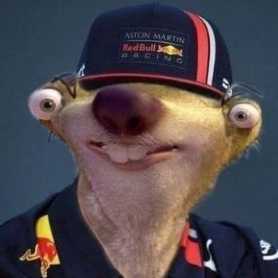

# Threads - String Art Generator

A C++ program that converts images into string art by simulating thread connections between pins arranged in a circle. The program uses OpenCV for image processing and generates high-quality string art representations of input images.

## Features

- Convert any image into string art
- Configurable number of pins and maximum lines
- Generates high-resolution output
- Creates animation of the string art generation process
- Saves pin sequence for reproducibility

## Demo

<div style="display: flex; gap: 20px; margin-top: 20px;">
  <div style="text-align: center;">
    
    <p><strong>Input</strong></p>
  </div>
  <div style="text-align: center;">
    
    <p><strong>Output</strong></p>
  </div>
</div>


## Prerequisites

- C++ compiler with C++17 support
- OpenCV library
- CMake (version 3.0 or higher)

## Building

The project uses CMake for building. To build the project:

```bash
./run.sh
```

This script will:

1. Create a build directory
2. Run CMake configuration
3. Build the project

## Usage

```bash
./threads.out <input_image> <output_image> [sequence_file] [-a]
```

### Parameters

- `input_image`: Path to the source image
- `output_image`: Path where the output image will be saved
- `sequence_file`: (Optional) Path to save the pin sequence
- `-a`: (Optional) Generate an animation of the string art creation process

### Example

```bash
./threads.out input.jpg output.png sequence.txt -a
```

## Configuration

You can modify these constants in `main.cpp` to customize the output:

- `PINS`: Number of pins around the circle (default: 300)
- `MIN_DISTANCE`: Minimum distance between pins (default: 30)
- `MAX_LINES`: Maximum number of lines to draw (default: 3500)
- `LINE_WEIGHT`: Weight to reduce error along drawn lines (default: 30)
- `SCALE_FACTOR`: Scale factor for output image (default: 4)
- `MAX_FRAMES`: Maximum frames for animation (default: 50)

## Output Files

- Main output: A PNG image showing the final string art
- Sequence file: (Optional) A text file containing the pin sequence
- Animation: (Optional) An AVI file showing the string art creation process

## Attribution

Based on the article : [Michael Crum's String Art Generator](https://michael-crum.com/string_art_generator/)
